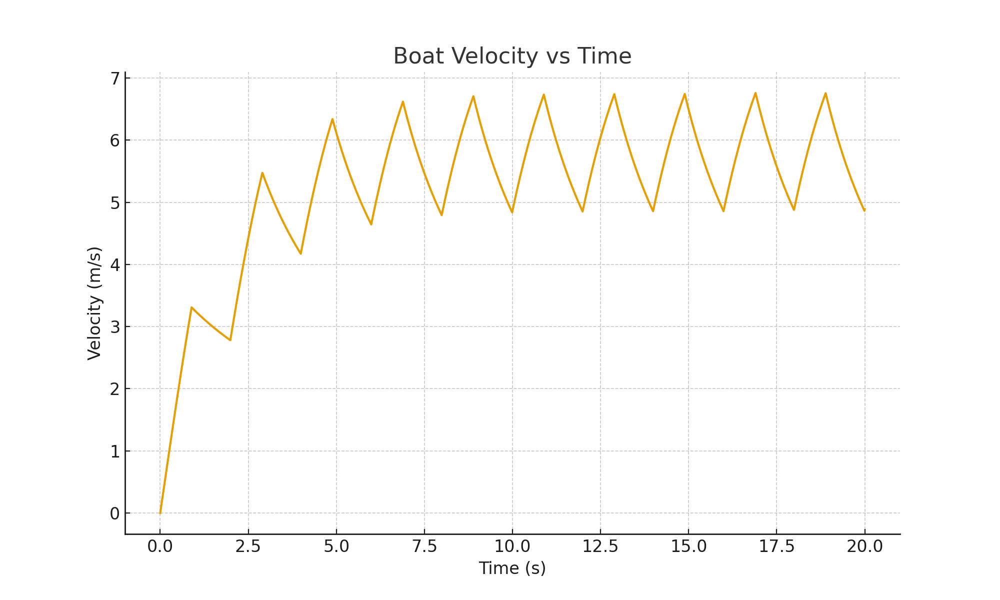
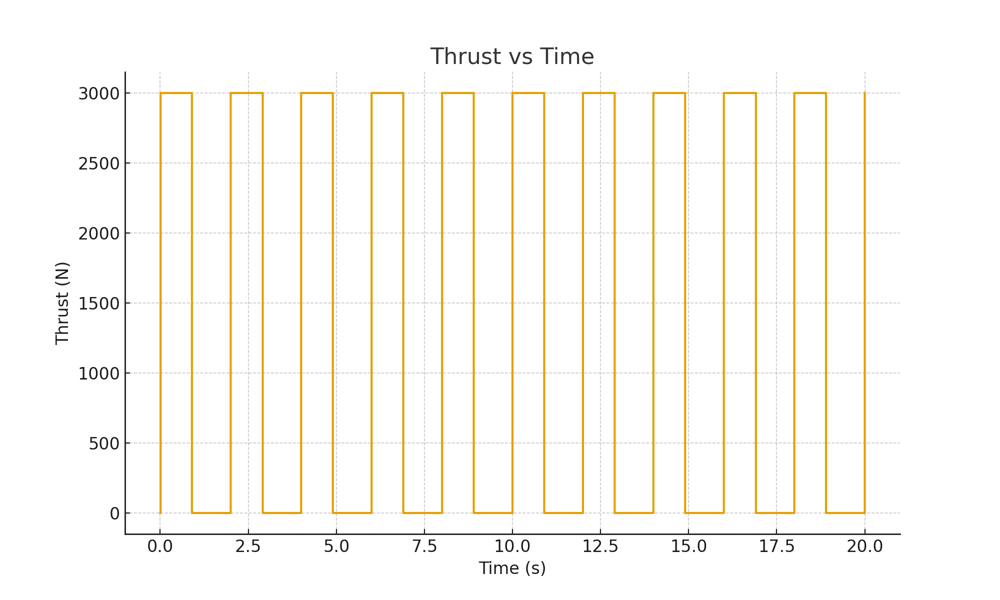
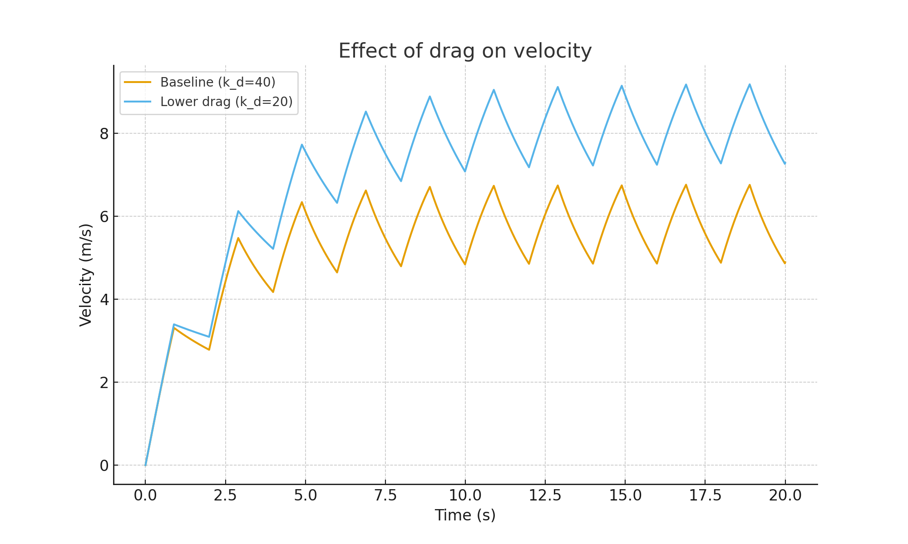
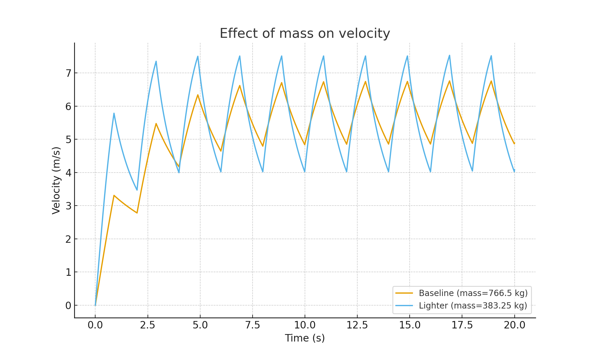
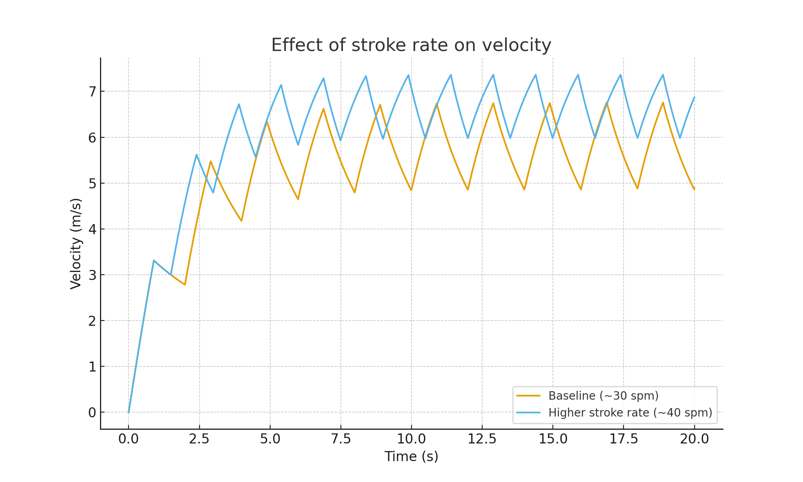

# Simulating Mechanical Energy Transfer in Rowing

This repository contains a physics-based rowing model and analysis tools that simulate boat velocity over repeated strokes and quantify how mechanical energy input is partitioned into drag losses and kinetic energy changes.

## Key Results (20 s simulation)
From `results/rowing_results_summary.txt`:
- Average velocity (last half): 5.785 m/s
- Maximum velocity: 6.759 m/s
- Total energy input by rowers: 141175.7 J
- Energy dissipated by drag: 132324.8 J
- Change in kinetic energy: 9167.0 J
- Mechanical efficiency: 6.49 %

## Figures
### Boat Velocity vs Time


### Thrust vs Time


### Sensitivity Analyses




## Repo Structure
- `src/` — simulation + analysis code
- `paper/` — LaTeX source + compiled PDF
- `figures/` — plots generated by the model
- `results/` — summary metrics and outputs

## How to Run
```bash
python3 -m venv .venv
source .venv/bin/activate
pip install -r requirements.txt
python src/rowing_model.py
python src/rowing_analysis.py